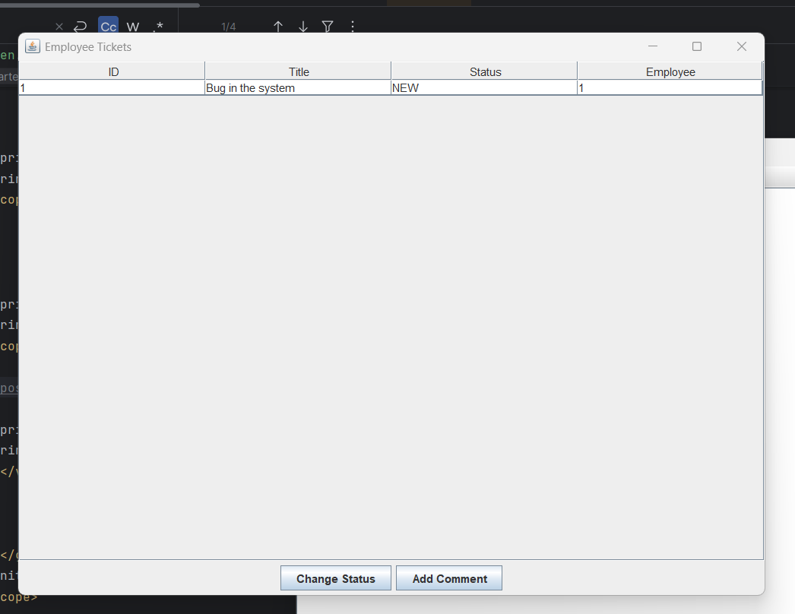

<h5>
I know I haven't done a lot of things, like hashing passwords (which is important), searching by ticket ID and status, doing tests, and implementing many features that I haven't used. I know that, but I didn't have time to check my code. I also know that, but I didn't have time to do it before the deadline. However, I can explain all of this if you want, and we can check my GitHub I’ve done a similar project like this, with CRUD functionality, but using a frontend web language :)
Best regards,
</h5>

<h2>Ticket Management</h2>
<h5>Each user (employee and IT support) has a role, and IT support also has the employee role.</h5>
<h6>I will only show the IT support interface.</h6>

Login

Employee Ticket List

We can change the employee's status.
 

We can add a comment.
 

Log to view the comments we have made.
 

Swagger Documentation

